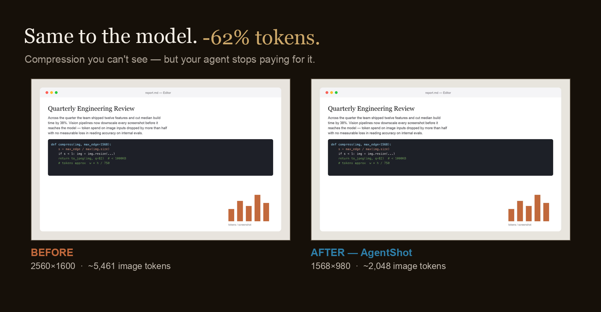

# AgentShot

为 AI agent 而生的截图工具。框选一块区域，自动压缩到视觉模型的最优尺寸并复制到剪贴板 —— 图像 token 最多省 81%，识别效果无损。

[English](README.md)



## 安装

```bash
curl -fsSL https://raw.githubusercontent.com/interesting-vibe-coding/agentshot/main/install.sh | bash
```

自动装到 `/Applications` 并启动。首次截图会请求屏幕录制权限——授权后重新打开 AgentShot。

## 用法

按 `⌘⇧2` 拖拽框选一块区域，弹出预览：

- `C` / `↩` —— 复制压缩图
- `⇧C` —— 复制原图（不压缩）
- `Esc` —— 取消

然后粘给你的 agent。快捷键、压缩档位、开机自启都在菜单栏（📸）里设。

## 原理

对视觉模型来说，图像 token 只取决于像素尺寸而非文件大小：`tokens ≈ 宽 × 高 / 750`。AgentShot 把长边压到 1568px —— 超过这个尺寸 Claude 本来也会自动降采样 —— 让你不再为模型用不到的像素付费。实测（gpt-5.5，DocVQA）：识别准确率不变，图像 token 省约 50%；整屏 4K 截图省约 81%。

---

主页与 benchmark：**https://interesting-vibe-coding.github.io/agentshot-site/** · MIT License · 隶属 [interesting-vibe-coding](https://github.com/interesting-vibe-coding)
