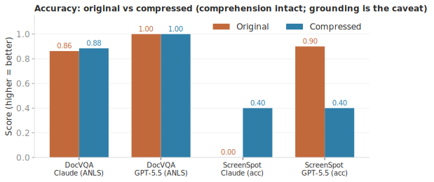
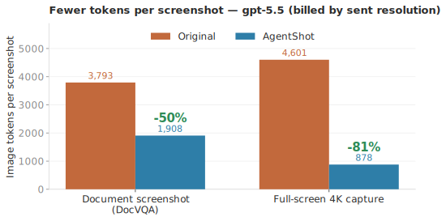

<h1 align="center">AgentShot 📸</h1>

<p align="center">
  <b>为 AI agent 而生的截图工具。</b><br>
  框选 → 自动压到视觉模型最优尺寸 → 进剪贴板。粘给任意 agent，<b>图像 token 最多省 81%</b>，<b>识别效果几乎无损</b>。
</p>

<p align="center">
  
  
  
  
</p>

<p align="center"><a href="README.md">🇬🇧 English</a></p>

---

粘给 AI agent 的截图往往大得没必要。Retina 截图动辄几百万像素，而对视觉模型来说 **token 只跟像素数有关，跟文件字节无关**。AgentShot 在截图进剪贴板前就把它压到模型的最优分辨率，让你不再为模型根本用不到的像素付费。

- ⚡ **一个快捷键**（`⌘⇧2`）→ 原生框选 → 压缩 → 进剪贴板，随处粘贴。
- 🎯 **智能上限**：长边 ≤ 1568px（Claude 甜点）+ JPEG q82，硬上限 **< 1000KB**。
- 🪶 **极致轻量**：仅菜单栏、无 Dock 图标、**零第三方依赖**、纯原生 macOS。
- 🔬 **有 benchmark 背书**：压缩不损模型对截图的理解——我们实测过。

## 为什么要压？（反直觉的点）

对 Claude / GPT，**图像 token 取决于像素尺寸而非字节**——`tokens ≈ 宽 × 高 / 750`。同尺寸下 5MB 的 PNG 和 200KB 的 JPEG token *一样*。所以省 token 的真正杠杆是**降分辨率**；1568px 正是 Claude 不再额外收费的点（更大的它也会自动降采样）。

## Benchmark
压缩会不会让模型「读不懂」截图？我们实测了：原图 vs AgentShot 压缩图的真实 A/B，`claude-sonnet-4.6` + `gpt-5.5` 经 OpenRouter，在 DocVQA（文字最密、对压缩最敏感的文档截图）上。数字全部来自真实 API 调用，完整方法见 [`bench/RESULTS.md`](bench/RESULTS.md)。

<p align="center">
  
  
</p>

- ✅ **识别准确率不变**——两个模型在压缩截图上得分一致。
- 💸 **图像 token 最多省 81%**（按发送分辨率计费的模型；gpt-5.5：文档 −50%，整屏 4K −81%）。

## 到底哪些场景真省 token？（取决于 harness）

关键看你的客户端在发给模型前有没有替你降采样：

| Harness / 链路 | 会自动降采样吗 | AgentShot 省什么 |
|---|---|---|
| **Anthropic API / Claude Code** | 会（服务端 >1568px） | 带宽 + 请求大小限制 |
| **Kiro** | 否——大截图甚至会**直接报错** | **真省 token + 解决报错** |
| **Codex 等多数 harness** | 一般不会 | **真省 token**（见上 −50%…−81%） |
| **OpenRouter / 自建 / 开源 VLM** | 原样转发你的分辨率 | **真省 token**，原图越大越划算 |

> 一句话：Claude 链路省的是带宽和可控性；Kiro / Codex / 任何不预处理的链路是实打实省 token 和钱，还能避开大图报错。

## 安装

```bash
git clone https://github.com/interesting-vibe-coding/agentshot
cd agentshot
./build.sh                 # clang 编译出 dist/AgentShot.app（零依赖）
open dist/AgentShot.app

# 不弹窗验证压缩管线：
./dist/AgentShot.app/Contents/MacOS/AgentShot --selftest 你的截图.png
```

首次运行会请求**屏幕录制**权限（截图必需）。另含 Swift 等价实现，`USE_SWIFT=1 ./build.sh` 可改用。

## 用法

- 菜单栏出现 📸 图标（无 Dock 图标，后台 `LSUIElement`）。
- 按 **`⌘⇧2`** → 拖拽框选 → 已压缩并在剪贴板，直接 `⌘V` 粘给 agent。
- 图标会闪一下结果，如 `✓ 176KB · -73% pixels`；`Esc` 取消。

## 原理

`screencapture -i`（原生框选）→ ImageIO `CGImageSourceCreateThumbnailAtIndex` 直接以 ≤1568px 解码（快，不解全图）→ JPEG 质量回退到 <1000KB → 原始 JPEG 字节写入 `NSPasteboard` 的 `public.jpeg`（绝不经 `NSImage`，否则会膨胀成未压缩 TIFF）。

> 剪贴板说明：macOS 可能额外暴露一个未压缩 TIFF 表示，但**像素同为 1568px**，所以无论 app 读哪个表示，token/费用节省都成立，仅原始字节大小有别。

## 配置

改 `Sources/AgentShot/AgentShot.m` 顶部常量：

```objc
static const NSInteger kMaxLongEdge = 1568;        // 长边上限（Claude 甜点；Opus 4.7+ 可设 2560）
static const CGFloat   kStartQ      = 0.82;        // JPEG 起始质量
static const NSInteger kByteLimit   = 1000 * 1024; // 硬上限 < 1000KB
```

快捷键改 `applicationDidFinishLaunching` 里的 `kVK_ANSI_2` / `cmdKey | shiftKey`。

## License

MIT
